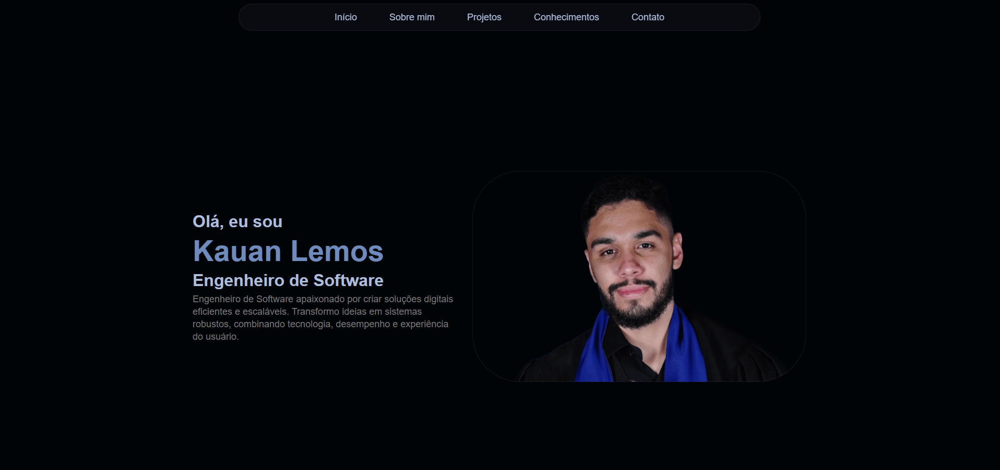

# Portfólio 

Este projeto é um portfólio pessoal desenvolvido para exibir meus projetos, habilidades técnicas e informações profissionais. O projeto foca em boas práticas de desenvolvimento, responsividade, organização do código e uma interface mais limpa e moderna.



## ⚙️ Funcionalidades 

- Exibição de projetos
- Seção "Sobre mim"
- Listagem de habilidades
- Design responsivo e moderno
- Formulário de contato

## 🛠️ Tecnologias Utilizadas
- React
- JavaScript 
- HTML5
- CSS3 
- Vite 

## 📁 Estrutura do Projeto
```
src/
 ├─ assets/
    ├─ components/
    ├─ img/
    ├─ pages/
    └─ styles/
 ├─ App.jsx
 └─ Main.jsx
```

## ▶️ Como Executar o Projeto
```
# Clone o repositório

https://github.com/DevLemos/portfolio-dev.git

# Instale as dependências

npm install

# Rode o projeto

npm run dev
```

